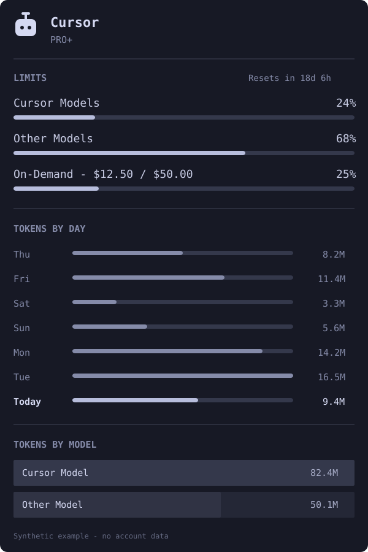

# Omarchy Cursor Usage

A **headless Omarchy plugin** that adds Cursor plan limits, On-Demand spend,
daily tokens, and model usage to the AI widget already in your top bar.

> **Built for Omarchy:** no second bar icon and no separate dashboard. Install,
> click the existing AI robot, then select **Cursor**.



---

### ☕ Support the Project
If this keeps you from repeatedly opening Cursor's billing dashboard, a tip is
always appreciated.

[](https://paypal.me/austraz)

---

### 💬 Feedback & Community
Found a bug or a Cursor API change? Open an
[**issue**](https://github.com/austrasien/omarchy-cursor-usage/issues).

---

## 🚀 Overview

The plugin reads your existing local Cursor login, requests account usage from
Cursor's dashboard APIs, and writes one private local snapshot for Omarchy's
stock AI panel.

```text
Cursor local login → Cursor dashboard API → private usage snapshot → Omarchy AI panel
```

| | Without | With Omarchy Cursor Usage |
| :--- | :--- | :--- |
| Plan limits | Open the Cursor dashboard | Cursor Models + Other Models meters |
| On-Demand | Check billing settings manually | Current spend against your configured cap |
| Token history | Browse usage pages | Seven days + top models in the bar panel |
| Shell reload | Panel can disappear temporarily | Last valid snapshot stays visible |

## ✨ Key Features

### 📊 Limits that match how you use Cursor
- Separate **Cursor Models** and **Other Models** meters.
- Optional **On-Demand** meter showing current spend and your configured
  individual or team limit.
- The redundant combined “Included total” meter is intentionally omitted.

### 📈 Token history
- Seven-day token chart.
- All-time breakdown for the four most-used models.
- Today’s prompts and sessions when Cursor exposes them.

### 🧩 Native Omarchy integration
- Reuses `omarchy.agents`; the plugin itself has no bar widget.
- Refreshes every five minutes and follows manual AI-panel refreshes.
- Keeps the last snapshot across shell/plugin reloads to avoid flicker.
- Resolves its collector beside the service, including on Omarchy versions
  that sanitize internal manifest paths.
- Python standard library only.

## 🛠 Installation

Requirements:

- Omarchy with `omarchy.agents` enabled
- Python 3
- Cursor IDE signed in, or Cursor Agent signed in with `cursor-agent login`

Install:

```sh
omarchy plugin add https://github.com/austrasien/omarchy-cursor-usage.git --enable
```

Click the existing AI icon and select **Cursor**. Press `r` or Enter in the
panel to refresh.

### Switching from the upstream repository

```sh
cd ~/.config/omarchy/plugins/io.github.mrlarsendk.cursor-usage
git remote set-url origin https://github.com/austrasien/omarchy-cursor-usage.git
git pull
omarchy restart shell
```

## 🔐 Privacy & Security

- Credentials are read locally from Cursor IDE's `state.vscdb`, with
  `~/.config/cursor/auth.json` as the Cursor Agent fallback.
- The token is sent only to `https://api2.cursor.sh` in the Authorization
  header. It is never printed or written to the usage snapshot.
- API redirects are refused so credentials cannot be forwarded to another
  origin.
- Local credential/cache reads reject symlinks and oversized files.
- `cursor.json` is atomically written with mode `0600`.

This integration uses Cursor's dashboard endpoints. Expired credentials are
not refreshed by the plugin; open Cursor or run `cursor-agent login`.

## 🗑 Removal

```sh
omarchy plugin remove io.github.mrlarsendk.cursor-usage
rm -f ~/.local/state/omarchy/agents/usage/cursor.json
```

The second command removes the retained usage snapshot and therefore the
Cursor chip. Login files and Cursor sessions are never modified.

## ⚖️ License & Credits

Licensed under the **MIT License**.

Based on
[mrlarsendk/omarchy-cursor-usage](https://github.com/mrlarsendk/omarchy-cursor-usage)
by Michael Larsen. This fork keeps the upstream copyright and license;
On-Demand metering, persistent snapshots, UI-focused limit selection, and
publication packaging by [austrasien](https://github.com/austrasien).
